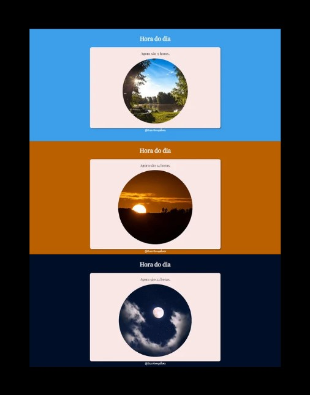

<h1 align="center"> HORA DO DIA </h1>

Programa exclusivo e gratuito, promovido pela plataforma Curso em Vídeo com o professor Gustavo Guanabara.

 

## Autores

- [@isisgoncalves](https://www.github.com/isisgoncalves)

## Referência

 - [Curso em Vídeo - Gustavo Guanabara](https://www.cursoemvideo.com/)

## 🚀 Tecnologias

Esse projeto foi desenvolvido com as seguintes tecnologias:

- HTML
- CSS
- JavaScript
- Git e Github

## 💻 Projeto

Este é um projeto que muda a interface conforme a hora do dia (manhã, tarde e noite).

- [Acesse o projeto finalizado, online.](https://isisgoncalves.github.io/Projeto-Discover/)
